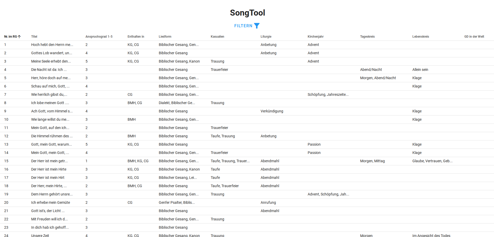

# Songtool CRUD

<h4 align="center">Vue.js based REST-ful CRUD system to store worship songs.</h4>

This is a small web application designed to provide easy access and filtering for church-related songs for the Swiss "Reformierte Kirchen Bern-Jura-Solothurn". It is based on https://github.com/what-crud/vue-crud, but has been heavily trimmed and much of the unneeded functionality has been removed. Instead, the filter options have been extended and polished to make the application as easy as possible to use.

You can see a live version at https://songtool.xyquadrat.ch.

Thank you to Szczepan Masny for developing vue-crud.

## License
[MIT](https://opensource.org/licenses/MIT)
